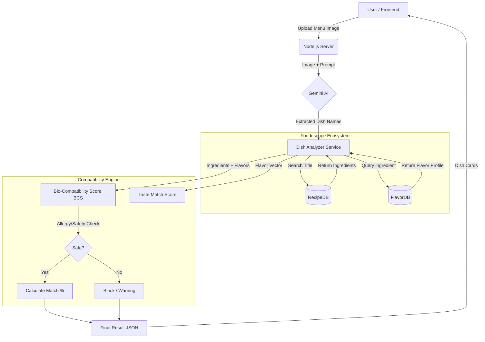

# Foodoscope (EatInSync) Prototype

This is the MERN stack prototype for the Foodoscope application, designed to help users eat safely by analyzing dishes for allergens, intolerances, and taste compatibility.

## 🧠 System Architecture

The application follows a linear analysis pipeline, integrating AI (Gemini) with structured food databases (RecipeDB, FlavorDB).



## 🔬 Analysis Pipeline

### 1. Dish Extraction (Gemini AI)
-   **Input**: Menu image uploaded via `MenuScanner.jsx`.
-   **Process**: The image is sent to **Google Gemini (Flash/Pro)** with a prompt to extract distinct dish names as a JSON array.
-   **Output**: `["Butter Chicken", "Garlic Naan", ...]`

### 2. Ingredient Resolution (RecipeDB)
-   **Usage**: Finds the "standard" version of a dish.
-   **Endpoint**: `/recipe2-api/recipe-bytitle`
-   **Logic**:
    -   Searches for the extracted dish name.
    -   Retrieves the full list of ingredients (e.g., "Butter Chicken" -> chicken, butter, tomato, cream, spices).
    -   *Fallback*: If no recipe is found, the dish name itself is treated as the primary ingredient.

### 3. Flavor Profiling (FlavorDB)
-   **Usage**: Understands the chemical and sensory properties of ingredients.
-   **Endpoint**: `/flavordb/molecules_data/by-commonName`
-   **Logic**:
    -   Each ingredient is "canonicalized" (e.g., "groundnut" -> "peanut").
    -   Fetches **Flavor Profile** (Sweet, Spicy, Bitter, Sour, Umami).
    -   Fetches **Functional Groups** (used to detect alcohol, fermentation, etc.).

### 4. Compatibility Engine
-   **Biological Score (BCS)**:
    -   **Hidden Allergens**: Checks for implied ingredients (e.g., "Soy Sauce" implies Gluten/Wheat).
    -   **Hard Block**: If an allergen is found, Score = 0 (Blocked).
    -   **Soft Warn**: Intolerances reduce the score but don't block.
    -   **Compound Checks**: Detects "Fermented" or "Spicy" compounds based on user sensitivity.
-   **Taste Match**:
    -   Constructs a **Dish Flavor Vector** (6D space: sweet, spicy, bitter, sour, umami, creamy).
    -   Calculates **Euclidean Distance** against the User's Taste Preference Vector.
    -   Returns a match percentage (0-100%).

## Features

-   **Dish Analysis**: Analyzes recipes using RecipeDB and FlavorDB APIs.
-   **Safety First**: Strictly blocks allergens, warns about intolerances, and checks for compound sensitivities (e.g., alcohol, fermentation).
-   **Taste Match**: Calculates a compatibility score based on your flavor preferences (Sweet, Spicy, Bitter, Sour, Umami).
-   **Alternatives**: Suggests safer recipe alternatives if a dish is blocked or has a low compatibility score.
-   **Reaction Logging**: Allows users to log how they felt after eating a dish to improve future recommendations.
-   **Profile Management**: Quick edits for allergies, intolerances, and taste preferences.

## Prerequisites

-   Node.js (v14+)
-   MongoDB (Local or Atlas)
-   Foodoscope API Key (RecipeDB / FlavorDB access)
-   Gemini API Key (Image Analysis)

## Setup

1.  **Clone the repository** (if applicable).
2.  **Install Dependencies**:
    ```bash
    # Server
    cd server
    npm install

    # Client
    cd ../client
    npm install
    ```

3.  **Environment Variables**:
    Create a `.env` file in the `server` directory:
    ```env
    PORT=5000
    MONGO_URI=mongodb://localhost:27017/foodoscope
    JWT_SECRET=your_jwt_secret_here
    FOODOSCOPE_API_KEY=your_api_key_here
    GEMINI_API_KEY=your_gemini_key_here
    ```

## Running the Application

1.  **Start the Backend**:
    ```bash
    cd server
    npm run dev
    # Runs on http://localhost:5000
    ```

2.  **Start the Frontend**:
    ```bash
    cd client
    npm start
    # Runs on http://localhost:5173 (Vite)
    ```

## Testing

To verify the safety logic (BCS and Allergy Blocking):

```bash
cd server
npm test
```

## Project Structure

-   `server/services/foodoscope.js`: Handles API calls to RecipeDB/FlavorDB with caching and synonym mapping.
-   `server/services/compatibilityEngine.js`: Core logic for BCS (Biological Compatibility Score) and TasteMatch.
-   `server/routes/scan.js`: Orchestrates the image extraction and analysis pipeline.
-   `client/src/pages/Dashboard.jsx`: Safety-first UI for displaying analysis results.
